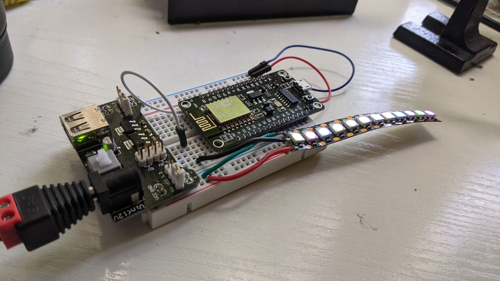
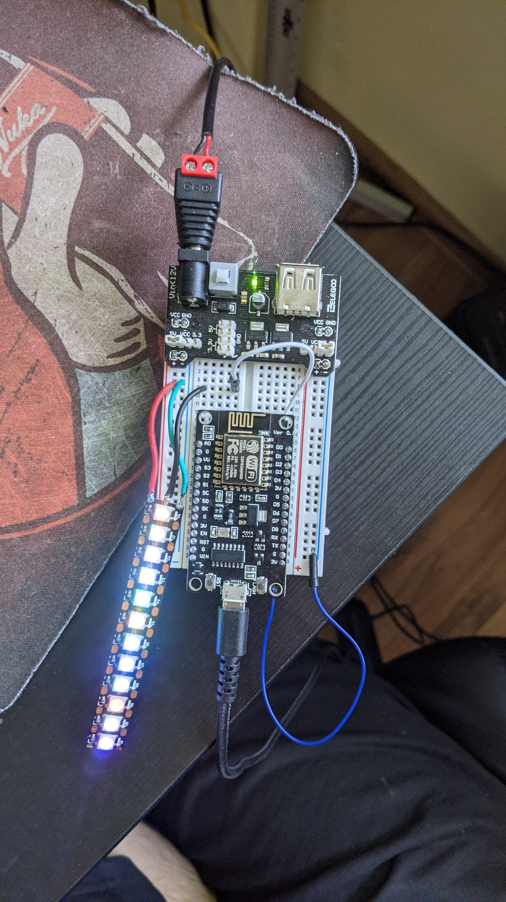
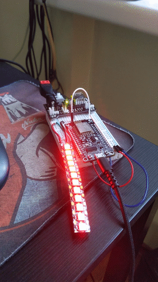
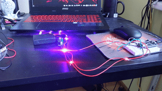
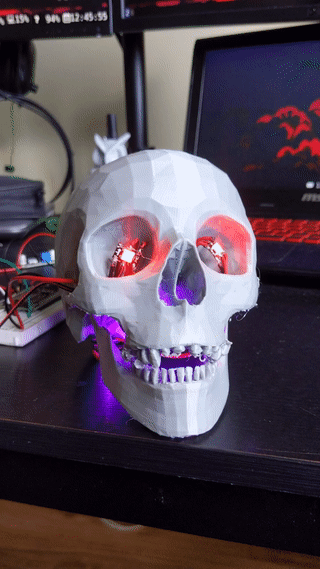

A simple dim script for my NodeMCU ESP8266 LED controller project.

## Prerequisites

MicroPython

```
pip install -r requirements
```

## Usage

Rename the script to `main.py` and place it in the root of the microcontroller.

Here's a quick way to get the script in the controller.

Remember to flash MicroPython first.

Install rshell and you can copy and see files in `/pyboard/`

```bash
$ pip install rshell
```

Connect to the board

```bash
$ sudo -E rshell -p /dev/ttyUSB0 -b 115200
```

And now it's possible to copy the `neo-dimmer.py` to the board using `rshell`

```bash
$ cp neo-dimmer.py /pyboard/main.py
```


## Purpose

This was a small personal project for me, when I 3D printed a poly skull
I wanted to put some LEDs inside, so I hacked some stuff together and made
a script with MicroPython.

Here's some media ->






